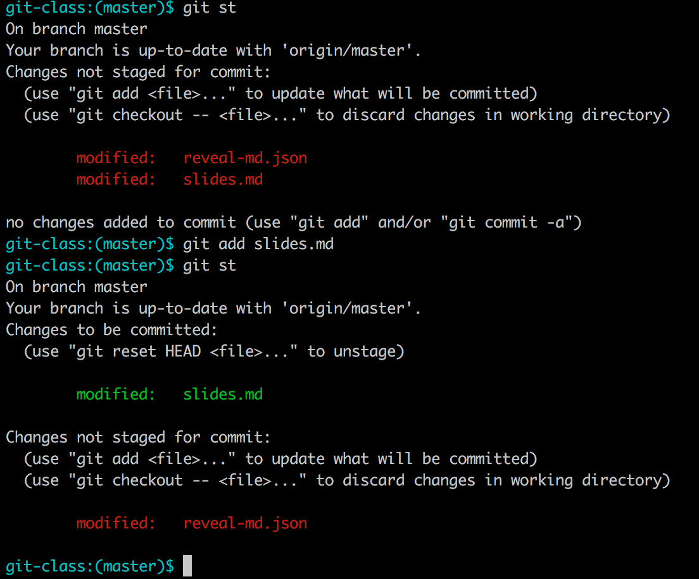

# Git

with:
* Kevin (harokevin0@gmail.com)
* Ken (kenschmidt@gmail.com)

---

## What is Git?

* Distributed Version Control System
* Written by Linus Torvalds (The linux guy)
* Widely used industry tool

Note: Ken

---

## What is git good for?

* Having a "Safe space" to work (branches)
* Collaborating with others
* Tracking file changes

Note: Ken

---

## Git Clients

* Command Line <i class="fa fa-linux" aria-hidden="true"></i> <i class="fa fa-apple" aria-hidden="true"></i> <i class="fa fa-windows" aria-hidden="true"></i>
  * https://git-scm.com/
* Source Tree <i class="fa fa-apple" aria-hidden="true"></i> <i class="fa fa-windows" aria-hidden="true"></i>
  * https://www.sourcetreeapp.com/
* gitk <i class="fa fa-linux" aria-hidden="true"></i> <i class="fa fa-apple" aria-hidden="true"></i> <i class="fa fa-windows" aria-hidden="true"></i>
  * https://git-scm.com/
* TortoiseGIT <i class="fa fa-windows" aria-hidden="true"></i>
  * https://tortoisegit.org/

Note: Ken

---

## Install git
https://git-scm.com/

Note: Kevin

---

## Is git installed?
~~~~
git --version
~~~~

Note: Kevin

---

## Make a folder, any folder
* Name it "git_basics" maybe?

* Open a terminal in the folder
* Windows: Shift+Right Click > Open terminal here
* OSX: cd ~/Desktop/git_basics

Note: Kevin

---

## Git Init
~~~~
git init
~~~~
* Creates a new **`*Repository*`**

Note: Kevin

---

## Git Status
~~~~
git status
~~~~
* Check the status of **Staged** and **Unstaged** changes

Note: Kevin - Add screenshot to show staged vs unstaged

---

## Let's add a file to our **repository**
* Create a text file in your directory

* nano file.txt
* control + o
* control + x
* enter
* ls (to check if file is there)

* open a text editor
* save file in your repository folder

Note: //TODO Clean up

---

## Git Status
~~~~
git status
~~~~
* Check the status of **Staged** and **Unstaged** changes

* This time, lets see what is different?

Note: Kevin - Add screenshot to show staged vs unstaged

---

## Git Add
~~~~
git add
~~~~
* Adds, or **Stages**, changes for commit

* Now we are going to add our file to our staged/tracked changes
Note: Kevin

---

## Git Add
~~~~
git add [file-name]
~~~~

Note: Kevin

---

## Git Commit
~~~~
git commit
~~~~
* Takes your **Staged** changes and saves them in the log
Note: Kevin

---

## Git log
~~~~
git log
~~~~
* Lets you see your **Commit** history. (History of saves)
* This is where gitk and Source Tree help with visualizing commits
Note: Kevin - extra slides for installing gitk or source tree?

---

## Git Checkout
~~~~
git checkout [file-name]
~~~~
* The undo button
* Lets you "go back" to the previously committed state of a file(s).
* Forgets modifications shown in **Staged** and **Unstaged** files.
Note: Kevin

---

## Git Branch
~~~~
git branch [your-branch-name]
~~~~
* Want to work on a new feature without breaking the project? Make a **branch**!
* Branches are like a sandbox
* You can play in them and not worry about breaking anything
* Very useful for working with others. Everyone has their own, or multiple, branch(es)!
Note: Ken

---

## Git Checkout
~~~~
git checkout [branch-name]
~~~~
* This command also allows you to **Checkout** other branches.
* Remember that this command, when given a file name, forgets the changes made to that file after the latest commit.
Note: Kevin

---

## Git Merge
~~~~
git merge [branch-name]
~~~~
* Sandbox branch works? Time to recombine with the rest of the project
* Merging brings what you are working on back into the  **master** branch
Note: Ken

---

//todo add next steps section
//Todo add slide on help flag
//TOdo reference materials
